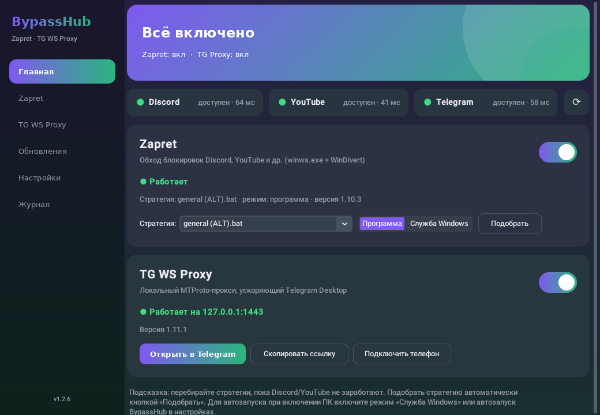
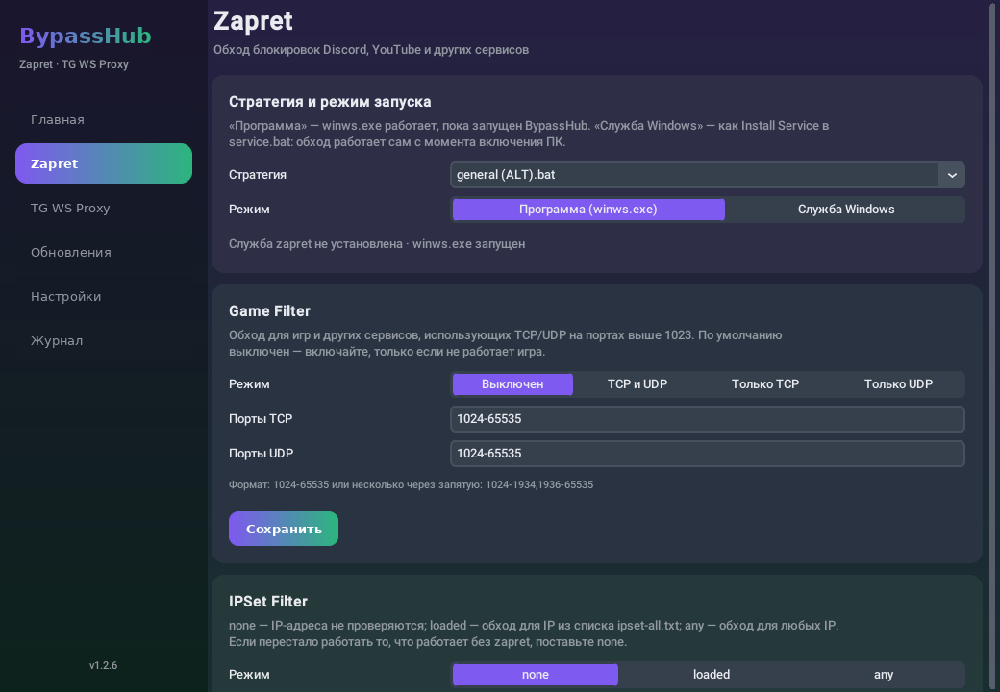
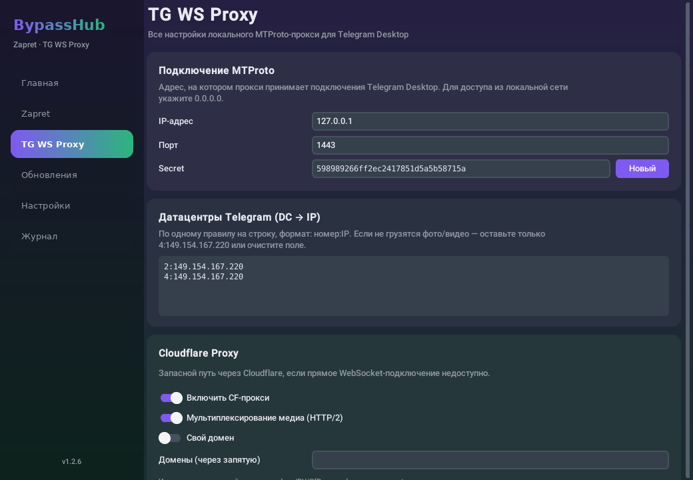
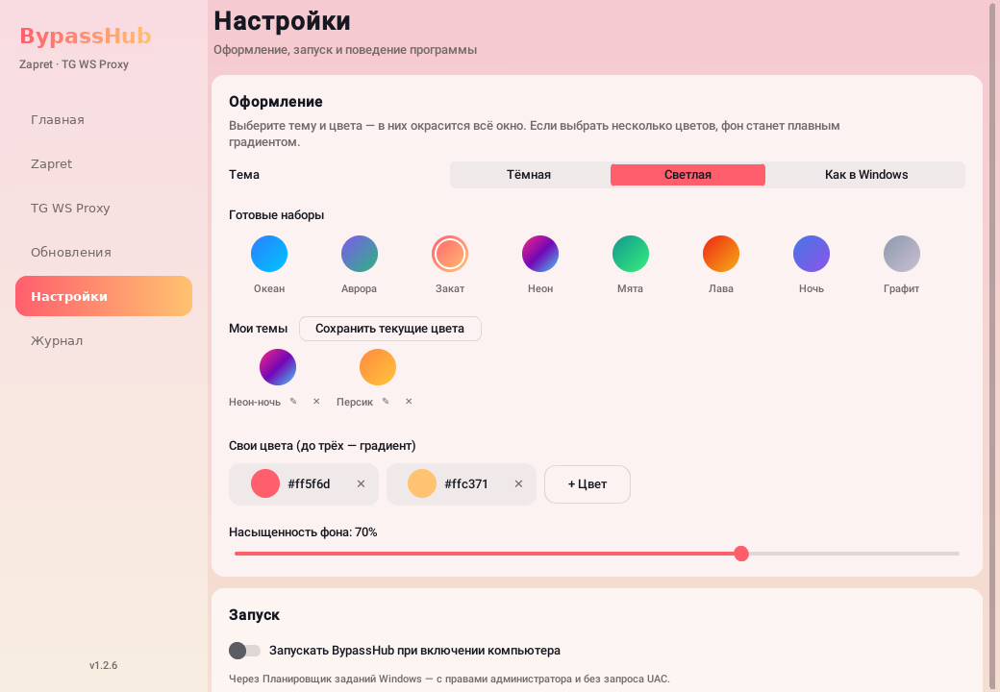
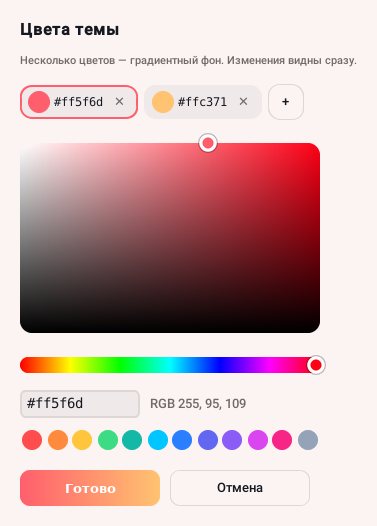
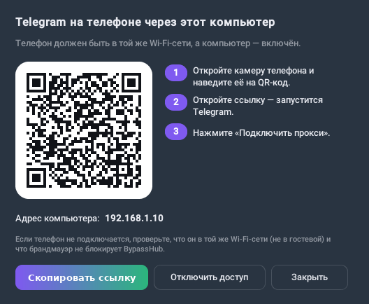

<div align="center">

# BypassHub

**Zapret и TG WS Proxy в одной программе — включаются одной кнопкой и обновляются сами.**

[](https://github.com/Miffk/BypassHub/releases/latest)
[](https://github.com/Miffk/BypassHub/releases)

[](https://github.com/Miffk/BypassHub/actions/workflows/bypasshub.yml)

**[⬇ Скачать BypassHub.exe](https://github.com/Miffk/BypassHub/releases/latest)**



</div>

BypassHub — программа для Windows, которая собирает в одном окне два популярных инструмента:

- **[zapret-discord-youtube](https://github.com/Flowseal/zapret-discord-youtube)** — обход блокировок Discord, YouTube и других сайтов;
- **[tg-ws-proxy](https://github.com/Flowseal/tg-ws-proxy)** — локальный MTProto-прокси, который ускоряет Telegram.

Больше не нужно запускать `.bat`-файлы, вспоминать пункты `service.bat`, следить за новыми версиями на GitHub
и вручную переносить свои списки после обновления. Всё это BypassHub делает сам, а настройки обоих проектов
доступны обычными кнопками и переключателями.

## Содержание

- [Возможности](#возможности)
- [Скриншоты](#скриншоты)
- [Установка и первый запуск](#установка-и-первый-запуск)
- [Telegram на телефоне](#telegram-на-телефоне)
- [Вопросы и проблемы](#вопросы-и-проблемы)
- [Где хранятся данные](#где-хранятся-данные)
- [Безопасность](#безопасность)
- [Сборка из исходников](#сборка-из-исходников)
- [Благодарности и лицензии](#благодарности-и-лицензии)

## Возможности

### Главное

- **Два переключателя** — zapret и TG WS Proxy включаются и выключаются одним кликом, из окна, из трея или горячей клавишей.
- **Индикаторы доступности** Discord, YouTube и Telegram: зелёный — сервис открывается, с задержкой в миллисекундах.
  Проверка каждые 3 минуты, после каждого переключения и по кнопке ⟳.
- **Автоподбор стратегии zapret**: программа по очереди пробует все стратегии, проверяет сайты по TLS 1.2 и 1.3
  и предлагает лучшую — применить её можно одной кнопкой.
- **Значок в трее** с быстрыми переключателями; окно можно закрыть, а обход продолжит работать.
- **Автозапуск** при включении компьютера — через Планировщик заданий Windows, без окна UAC при каждом входе.
  Программа запоминает, что было включено, и восстанавливает это после перезагрузки.

### Zapret — всё, что умеет `service.bat`, но кнопками

- Выбор стратегии (`general*.bat`) и режима запуска: **«Программа»** (winws работает, пока открыт BypassHub)
  или **«Служба Windows»** (как *Install Service* — обход работает даже без BypassHub).
- **Game Filter** (вкл/выкл, TCP/UDP, диапазоны портов) и **IPSet Filter** (none / loaded / any), обновление IPSet-списка.
- Замена активных фейков (Discord UDP, Game Filter UDP).
- **Исключение программ**: Steam, Epic Games, Battle.net, Riot, EA, Ubisoft, FACEIT, Xbox — их домены не попадают под обход,
  чтобы магазины и игры не ломались. Можно добавить свои домены и включить экспериментальное «обучение» по IP-адресам.
- Редактор пользовательских списков (`list-general-user.txt`, `list-exclude-user.txt`, `ipset-exclude-user.txt`).
- Обновление файла `hosts`, диагностика (поиск конфликтующих служб, очистка кэша Discord), тест стратегий, удаление служб.

### TG WS Proxy — все настройки в одном окне

Адрес и порт, secret, соответствие DC → IP, Cloudflare-прокси (HTTP/2, свой домен), Cloudflare Worker, подробный журнал,
размер буфера и пула, размер лога, тестовые DC. Кнопки **«Открыть в Telegram»** (прокси добавляется в Telegram Desktop
в один клик), **«Скопировать ссылку»** и **«Подключить телефон»**.

### Обновления

- BypassHub сам проверяет GitHub zapret и tg-ws-proxy — при запуске и каждые 6 часов (интервал настраивается).
- Новые версии скачиваются и **проверяются по SHA-256**, который публикует GitHub.
- Ваши настройки zapret (списки, Game Filter, IPSet, фейки, свои стратегии) **переносятся в новую версию**,
  работающий обход перезапускается сам. Старые версии и временные файлы удаляются.
- **Самообновление**: сама программа тоже обновляется из [релизов](https://github.com/Miffk/BypassHub/releases)
  этого репозитория — скачивает новый `BypassHub.exe`, подменяет себя и перезапускается.

### Оформление

- Тёмная, светлая или «как в Windows».
- Готовые наборы цветов и **свои цвета** (до трёх): всё окно окрашивается плавным градиентом, как темы в Discord.
  Ползунок «Насыщенность фона» регулирует силу окраски.
- Удобное окно выбора цвета: квадрат насыщенности/яркости, полоса оттенка, HEX, быстрые цвета — изменения видны сразу.
- **«Мои темы»** — созданные сочетания цветов сохраняются, их можно выбрать одним кликом, переименовать или удалить.
- Тема меняется на лету, с плавным переходом, без перезапуска.

### Горячие клавиши

Работают в любой программе, даже когда окно свёрнуто в трей:

| Действие | По умолчанию |
|---|---|
| Zapret вкл/выкл | `Ctrl+Alt+Z` |
| TG WS Proxy вкл/выкл | `Ctrl+Alt+T` |
| Показать/скрыть окно | `Ctrl+Alt+B` |
| Проверить доступность сервисов | не задано |

Любое сочетание меняется в «Настройках» (нажать на него и затем новые клавиши), каждое можно отключить,
а можно выключить все сразу. Если сочетание уже занято другой программой, BypassHub об этом скажет.

### Прочее

- **Резервная копия**: экспорт и импорт всех настроек (BypassHub, zapret, TG WS Proxy) в один JSON-файл — удобно при переустановке Windows.
- **Журнал** событий прямо в программе.

## Скриншоты

<table>
  <tr>
    <td align="center"><br><sub>Настройки zapret</sub></td>
    <td align="center"><br><sub>TG WS Proxy</sub></td>
  </tr>
  <tr>
    <td align="center"><br><sub>Светлая тема и свои цвета</sub></td>
    <td align="center"><br><sub>Выбор цвета</sub></td>
  </tr>
</table>

## Установка и первый запуск

1. Скачайте `BypassHub.exe` со страницы **[Releases](https://github.com/Miffk/BypassHub/releases/latest)**.
   Положите его в любую удобную папку (например, `C:\Programs\BypassHub`) — установка не нужна.
2. Запустите. Windows попросит права администратора: они нужны драйверу WinDivert, на котором работает zapret,
   а также для служб и файла `hosts`.
3. При первом запуске BypassHub сам скачает последние версии zapret и tg-ws-proxy.
4. Включите zapret на главной. Если Discord или YouTube не открываются — нажмите **«Подобрать»**,
   и программа найдёт рабочую стратегию для вашего провайдера.
5. Включите TG WS Proxy и нажмите **«Открыть в Telegram»** — Telegram Desktop предложит добавить прокси.
6. По желанию: в «Настройках» включите автозапуск, чтобы всё работало сразу после включения компьютера.

> [!TIP]
> Если Windows Defender или другой антивирус ругается на zapret — это ожидаемо, см. [вопросы](#вопросы-и-проблемы).

## Telegram на телефоне

Прокси, запущенный на компьютере, может ускорять Telegram и на телефоне в той же Wi-Fi-сети:



1. На главной нажмите **«Подключить телефон»**.
2. BypassHub откроет прокси для домашней сети и сам добавит правило в брандмауэр Windows.
3. Наведите камеру телефона на QR-код, откройте ссылку — запустится Telegram.
4. Нажмите «Подключить прокси».

Адрес компьютера выбирается автоматически: адаптеры VPN и виртуальных машин пропускаются.
Если на компьютере включён VPN, программа предупредит — он может мешать подключению (Radmin VPN не мешает,
о нём предупреждения нет). Кнопка **«Отключить доступ»** закрывает прокси для сети и удаляет правило брандмауэра.

<br clear="right">

## Вопросы и проблемы

<details>
<summary><b>Антивирус удаляет winws.exe или WinDivert</b></summary>

zapret работает через драйвер WinDivert, который перехватывает сетевые пакеты, — поэтому некоторые антивирусы
помечают его как «потенциально нежелательную программу» (HackTool / RiskTool). Это ложное срабатывание:
BypassHub скачивает только официальные релизы zapret-discord-youtube и проверяет их контрольную сумму.
Добавьте папку `C:\ProgramData\BypassHub` в исключения антивируса.
</details>

<details>
<summary><b>Discord или YouTube всё равно не работают</b></summary>

- Нажмите «Подобрать» на главной — разным провайдерам подходят разные стратегии.
- В разделе Zapret откройте диагностику: она найдёт конфликтующие службы (другие копии zapret, GoodbyeDPI и т. п.)
  и может очистить кэш Discord.
- Убедитесь, что не запущен другой zapret или GoodbyeDPI — одновременно работать может только один.
- Обновите IPSet-список и файл `hosts` в разделе Zapret.
</details>

<details>
<summary><b>Перестали работать игры или Steam</b></summary>

В разделе Zapret отметьте нужные программы в «Исключениях» или выключите Game Filter.
zapret работает на уровне сетевых пакетов и не знает, какой программе принадлежит пакет, поэтому исключение
программы — это исключение её доменов (и, в экспериментальном режиме, IP-адресов, к которым она подключена).
</details>

<details>
<summary><b>Телефон не подключается к прокси</b></summary>

- Телефон и компьютер должны быть в одной Wi-Fi-сети (не в гостевой — там устройства изолированы).
- Выключите VPN на компьютере и на телефоне.
- Проверьте, что в окне «Подключить телефон» выбран адрес домашней сети (обычно `192.168.x.x`).
</details>

<details>
<summary><b>Работает ли с VPN?</b></summary>

Обычно VPN и zapret одновременно не нужны: VPN и так шифрует весь трафик. Если VPN включён, трафик идёт через него,
и zapret на сайты, которые открываются через VPN, не влияет.
</details>

<details>
<summary><b>Как удалить BypassHub</b></summary>

1. В «Настройках» выключите автозапуск, а в разделе Zapret — удалите службы (если включали режим «Служба Windows»).
2. Закройте программу через значок в трее → «Выход».
3. Удалите `BypassHub.exe` и папку `C:\ProgramData\BypassHub`.
</details>

## Где хранятся данные

Все данные лежат в `C:\ProgramData\BypassHub` — путь без кириллицы и вне OneDrive, так zapret работает надёжнее:

```
C:\ProgramData\BypassHub\
  settings.json     настройки BypassHub
  zapret\           релиз zapret-discord-youtube с вашими списками и настройками
  tgwsproxy\        TgWsProxy.exe + TgWsProxy_data\config.json (портативный режим)
  logs\             bypasshub.log, winws.log
```

Папку можно сменить параметром `--data-dir` или переменной окружения `BYPASSHUB_DATA`.

## Безопасность

- BypassHub скачивает только **официальные релизы** с GitHub и сверяет их SHA-256 с тем, что публикует GitHub.
- Сам `BypassHub.exe` собирается **GitHub Actions** из исходников этого репозитория — сборку любого релиза можно
  проследить во вкладке [Actions](https://github.com/Miffk/BypassHub/actions/workflows/bypasshub.yml).
- Программа не собирает и не отправляет никаких данных. В сеть она обращается только к GitHub (обновления)
  и к проверяемым сайтам — Discord, YouTube, Telegram и т. п. (индикаторы доступности и подбор стратегии).
- Права администратора нужны только для zapret (драйвер WinDivert), служб Windows, файла `hosts` и правила брандмауэра.

## Сборка из исходников

Нужны Windows и Python 3.10+:

```bat
git clone https://github.com/Miffk/BypassHub.git
cd BypassHub\BypassHub
build.bat
```

Готовый файл — `dist\BypassHub.exe`. Запуск без сборки: `pip install -r requirements.txt` и `python main.py`.
Тесты: `python -m pytest`. Подробности для разработчиков — в [BypassHub/README.md](BypassHub/README.md).

## Благодарности и лицензии

- [zapret](https://github.com/bol-van/zapret) — **bol-van**, и сборка [zapret-discord-youtube](https://github.com/Flowseal/zapret-discord-youtube) — **Flowseal** (MIT);
- [tg-ws-proxy](https://github.com/Flowseal/tg-ws-proxy) — **Flowseal** (MIT);
- [WinDivert](https://github.com/basil00/WinDivert) — **basil00**;
- интерфейс — [CustomTkinter](https://github.com/TomSchimansky/CustomTkinter).

BypassHub не содержит кода zapret и tg-ws-proxy: при первом запуске и при обновлениях он скачивает их официальные релизы
с GitHub авторов. Все права на эти проекты принадлежат их авторам.

> [!NOTE]
> Программа предназначена для восстановления доступа к сервисам, которые замедляет или блокирует ваш провайдер.
> Пользуйтесь ею в соответствии с законодательством вашей страны.
